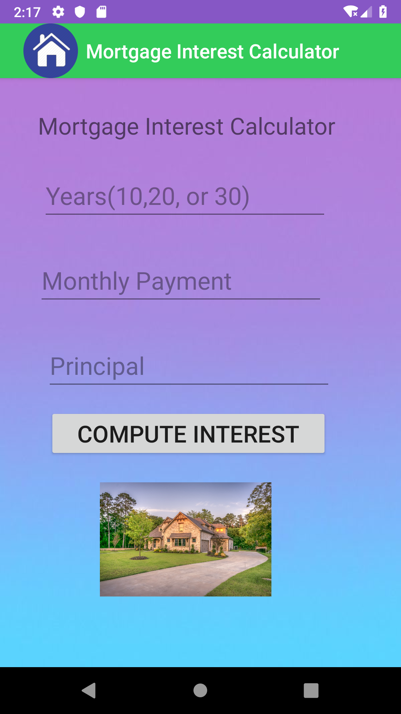
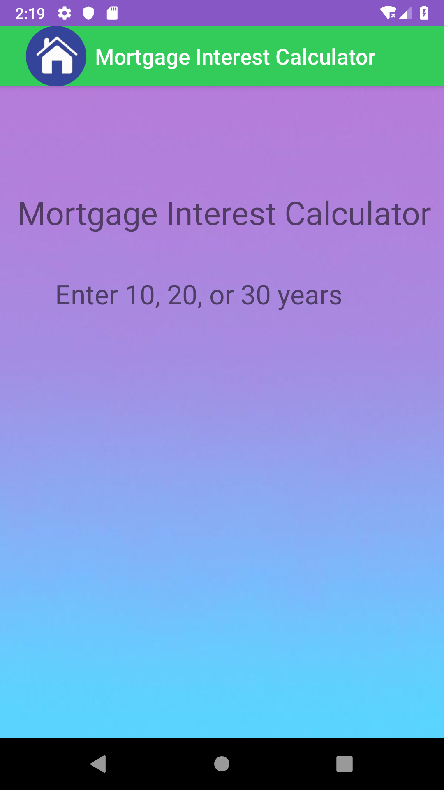
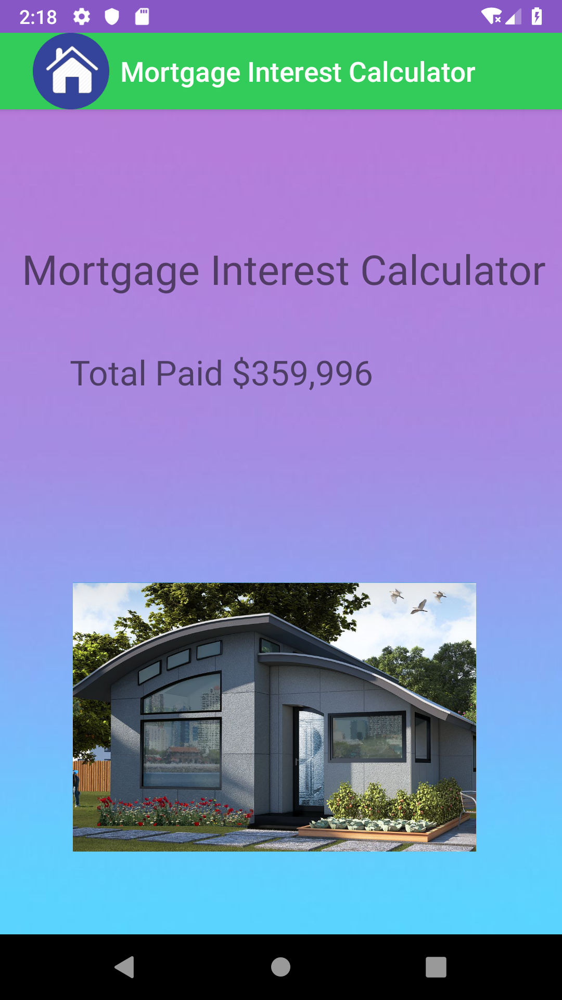

#LIS4331 Adv Web App Development

##Shea Wickenden

###A4 Reqs:

1. Include splash screen image, app title, intro text
2. Include images
3. Must use persistent data: SharedPrefernces
4. Widgets and images must be vertically and horizontally aligned
5. Add background colors and or theme
6. Create display launcher icon

####README.md should include:
 - screenshot of running app's splash screen
 - screenshot of running app's invalid screen
 - screenshot of running app's valid screen
 
 Screenshots:
 
 | image 1| image 2| image 3|
 |      ---    |     ---     |     ---    |
 | |  | |
 
