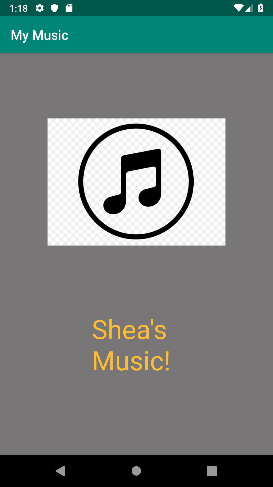
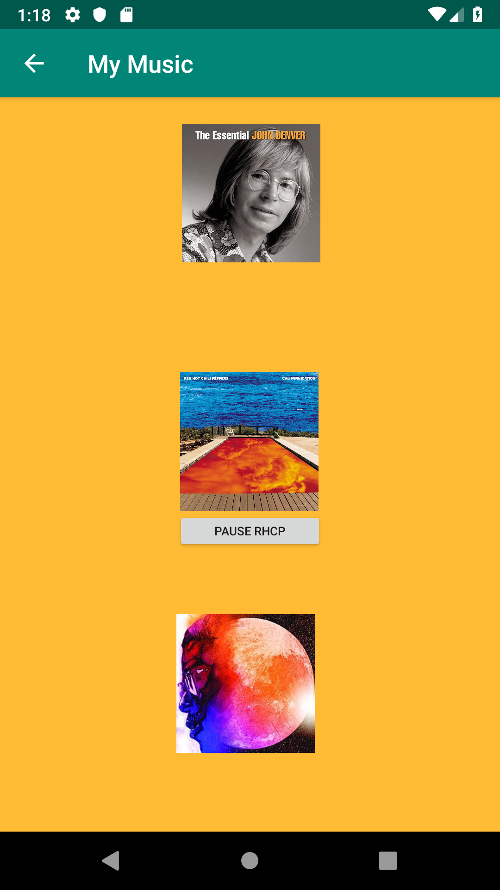
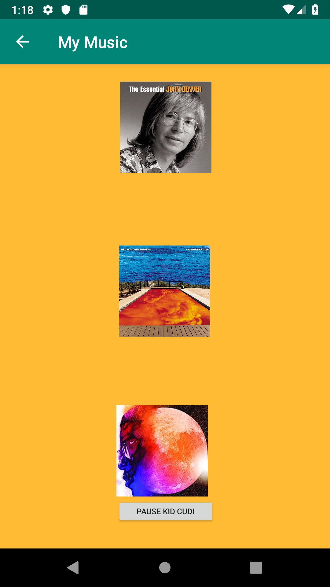

# LIS4331 Advanced Mobile Applications Dev

## Shea Wickenden

### Project 1 Requirments:

1. Include splash screen image, app title, intro text
2. Include artists’ images and media
3. Images and buttons must be vertically and horizontally aligned
4. Must add background color(s) or theme
5. Create and displaylauncher icon image\

#### README.md should include the following:
*Screnshot of splash screen
*Screenshot of follow-up screen
*Screenshots of play/pause interfaces

##### Assignment Screenshots

 
